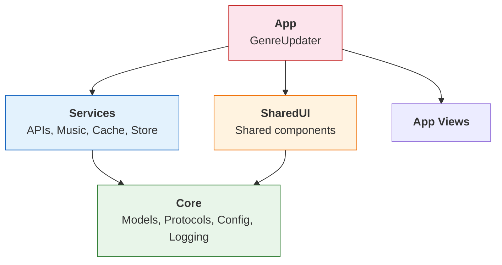
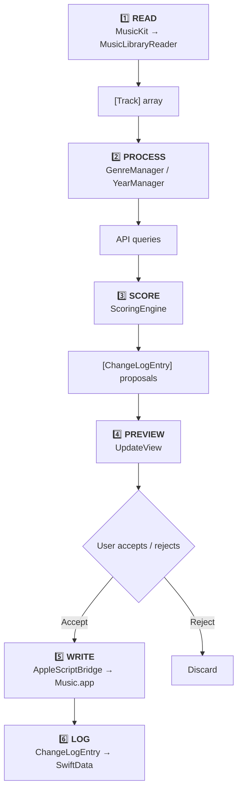
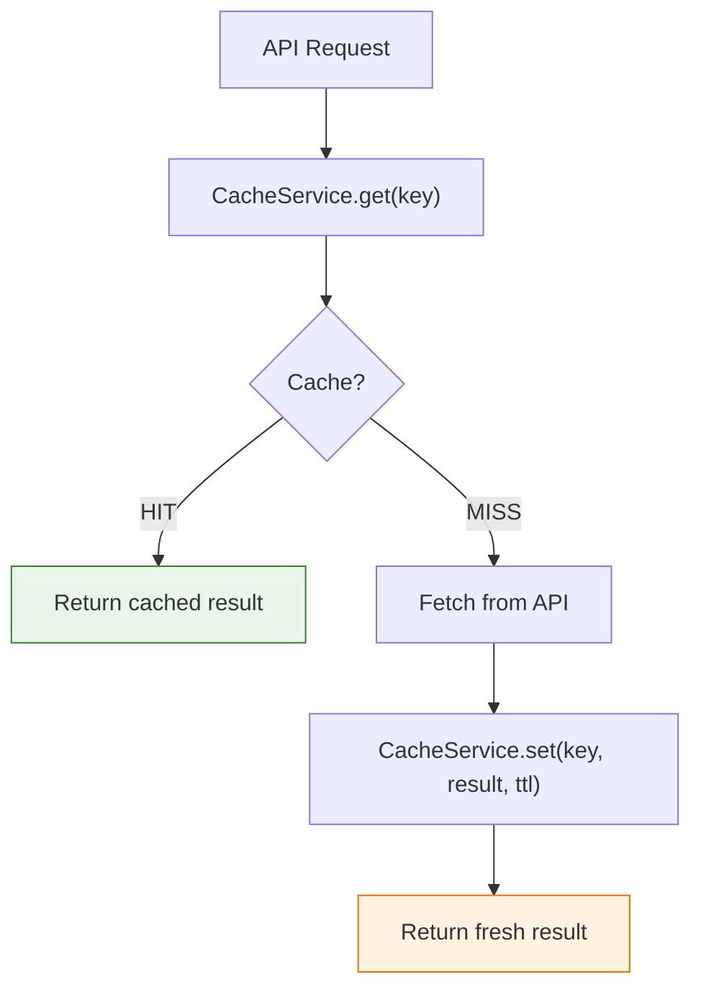
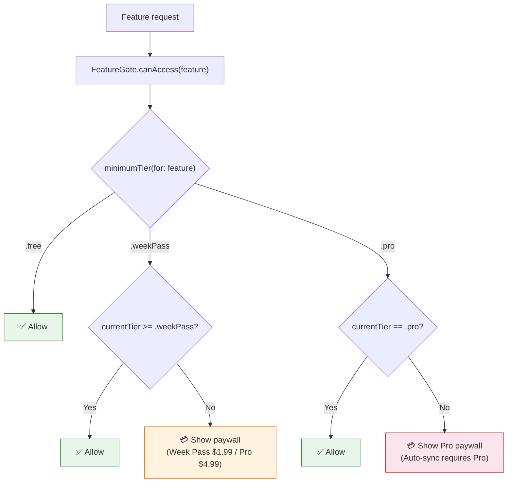
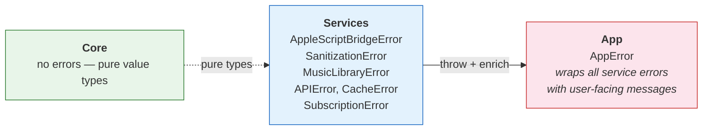
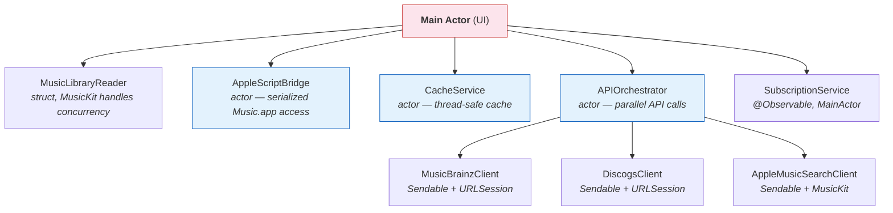
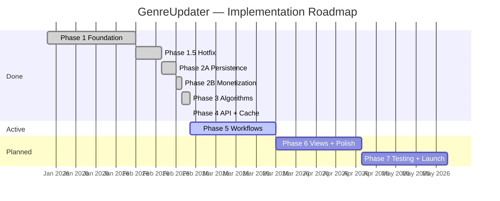

# GenreUpdater -- Product Requirements Document

> Version 1.0 | Last updated: 2026-02-15 | Status: Active
>
> Technical companion: [[TDD]] — file mapping, pattern translations, architecture implementation, lessons learned

---

## Table of Contents

1. [Product Overview](#1-product-overview)
2. [User Experience and Scenarios](#2-user-experience-and-scenarios)
3. [Feature Specification](#3-feature-specification)
4. [Architecture Decision Records](#4-architecture-decision-records)
5. [Technical Architecture](#5-technical-architecture)
6. [Data Model](#6-data-model)
7. [Monetization](#7-monetization)
8. [Implementation Phases](#8-implementation-phases)
9. [Quality Requirements](#9-quality-requirements)
10. [Testing Strategy](#10-testing-strategy)
11. [Monitoring and Observability](#11-monitoring-and-observability)
12. [Security and Privacy](#12-security-and-privacy)
13. [Discovered Missing Components](#13-discovered-missing-components)

---

## 1. Product Overview

### What

GenreUpdater is a native macOS application that automatically identifies and corrects genre and year metadata in a user's Apple Music library. It reads the library via MusicKit, determines the correct metadata from external APIs (MusicBrainz, Discogs, Apple Music Search), and writes corrections back via AppleScript.

### Problem

Apple Music frequently has incorrect, incomplete, or missing genre and year information:

- Tracks imported from CDs or other sources often have blank genres
- Apple Music's automatic genre tagging is frequently wrong or overly broad
- Release years are sometimes the reissue/remaster date rather than the original release year
- Users with large libraries (5K-30K+ tracks) cannot manually fix thousands of entries

### Solution

GenreUpdater automates the entire correction pipeline:

1. **Read** the user's Music.app library (fast bulk read via MusicKit)
2. **Determine** correct genres and original release years by querying multiple external APIs
3. **Score** results using a configurable algorithm ported from a battle-tested Python implementation
4. **Preview** proposed changes before applying them
5. **Write** corrections to Music.app via AppleScript (the only available write mechanism)
6. **Track** all changes with full undo/revert capability

### Target Audience

- Power users of Apple Music with large personal libraries (5,000-30,000+ tracks)
- Users who value accurate metadata for smart playlists, browsing, and organization
- Music collectors who have imported CDs, purchased from iTunes Store, or use Apple Music subscription
- Users migrating from the existing Python CLI tool (genreupdater.py)

### Differentiator

GenreUpdater is the only native macOS application offering automated genre/year correction for Apple Music. Existing alternatives are:

- Python scripts (require terminal knowledge, no GUI, no App Store distribution)
- Web services (cannot write to local Music.app library)
- Manual editing (impractical for large libraries)

### Distribution

- Mac App Store (primary)
- Freemium model with Pro subscription
- Minimum macOS 15 (Sequoia)

---

## 2. User Experience and Scenarios

### 2.1 Onboarding (First Launch)

**Goal**: Get the user from download to their first metadata correction in under 2 minutes.

**Flow**:
1. Welcome screen explains what the app does (one sentence + screenshot)
2. Grant Music.app access (system permission dialog)
3. Install AppleScript helper scripts to `~/Library/Application Scripts/` (one-click, with explanation why)
4. Quick library scan shows track count and how many have missing/suspicious metadata
5. Suggest starting with a small batch (50 tracks) to demonstrate the workflow

**OnboardingView**: Full-screen flow with 4 steps. Each step has a title, explanation, action button, and skip option. Progress dots at the bottom.

### 2.2 Genre Update

**Flow**:
1. Select tracks: by artist, album, playlist, or "all with missing genre"
2. App determines genres using its algorithm (progress bar shown)
3. Preview screen shows proposed changes in a table: Track | Current Genre | Proposed Genre | Confidence
4. User can accept all, reject all, or toggle individual changes
5. Apply writes changes to Music.app
6. Summary report with success/failure counts

### 2.3 Year Update

**Flow**:
1. Select tracks (same selection mechanisms as genre)
2. App queries external APIs for original release years (progress with estimated time)
3. Scoring algorithm ranks candidates from multiple sources
4. Preview screen: Track | Current Year | Proposed Year | Confidence | Source
5. User reviews and applies
6. Summary with details on which API provided each result

### 2.4 Batch Operations (Week Pass / Pro)

**Flow**:
1. Select entire library or large subset
2. Configure: which operations (genre, year, both), confidence thresholds
3. Start batch with checkpoint support (can pause/resume)
4. Real-time progress: processed/total, ETA, current track
5. Final report with export option (CSV)

### 2.5 Reports Tab

**ReportsView**: Two-tier reports tab in the main sidebar.

**Free tier — Change Log**:
- Scrollable table of all ChangeLogEntry records (track, change type, old → new, timestamp)
- Filters: by change type (genre/year/cleaning), by date range, by artist/album
- Sort: by date (default), by artist, by change type
- Empty state: "No changes yet — update some tracks to see your history here"

**Week Pass / Pro — Charts + Aggregate Stats**:
- Total tracks processed, genres corrected, years updated (summary cards)
- Timeline chart of corrections over time (Swift Charts)
- Genre distribution before/after (bar chart)
- API usage statistics (requests per source)
- Performance metrics (avg time per track)
- Free users see a paywall overlay on the charts section with Week Pass ($1.99) and Pro ($4.99/mo) options

### 2.6 Screen Descriptions

**MainView**: Split-view layout. Left sidebar shows library sections (All Tracks, By Artist, By Album, Playlists, Recent Changes, Reports). Right content area shows the selected section's tracks in a table. Toolbar has buttons for Update Genre, Update Year, and Settings.

**UpdateView**: Modal sheet over MainView. Three states: Configuring (select options) -> Processing (progress) -> Preview (results table with accept/reject).

**Settings**: Standard macOS Settings window with tabs: General, API Keys, Scoring, Cleaning, Subscription, Advanced.

**BatchView** (Pro): Full-screen view replacing MainView during batch operations. Shows progress ring, current track info, running statistics, and pause/resume/cancel controls.

**ReportsView**: Reports tab in the sidebar. Top section shows the change log table (Free tier — visible to all users). Bottom section shows aggregate statistics and Swift Charts (Week Pass / Pro — Free users see a paywall overlay). Filters and sort controls at the top of each section.

---

## 3. Feature Specification

### Feature Matrix

| Feature | MoSCoW | Free | Week Pass | Pro | Phase |
|---------|--------|------|-----------|-----|-------|
| Genre determination | Must | 500 tracks | Unlimited | Unlimited | 3 |
| Year determination | Must | 500 tracks | Unlimited | Unlimited | 3 |
| Change preview before apply | Must | Yes | Yes | Yes | 5 |
| Undo/Revert changes | Must | Yes | Yes | Yes | 5 |
| MusicKit library reading | Must | Yes | Yes | Yes | 2 |
| AppleScript writing | Must | Yes | Yes | Yes | 2 |
| API caching (reduce API calls) | Must | Yes | Yes | Yes | 4 |
| Batch processing (full library) | Should | No | Yes | Yes | 5 |
| Auto-sync (background updates) | Should | No | **No** | **Yes** | 5 |
| Artist name cleaning | Should | No | Yes | Yes | 3 |
| Album name cleaning | Should | No | Yes | Yes | 3 |
| Reports tab (change log) | Should | Yes | Yes | Yes | 6 |
| Reports charts + stats | Could | No | Yes | Yes | 6 |
| CSV export of changes | Could | No | Yes | Yes | 6+ |
| Custom genre mappings | Could | No | Yes | Yes | 6 |
| Keyboard shortcuts | Could | Yes | Yes | Yes | 6 |

### Acceptance Criteria

**Genre Determination**
- AC-1: Given a track with empty genre, when processed, then a genre is determined from MusicBrainz/Discogs with confidence score > 50%
- AC-2: Given a track with existing genre, when processed and a better match is found, then both old and new are shown in preview
- AC-3: Free tier processes up to 500 unique tracks; attempting more shows upgrade prompt
- AC-4: Results match Python version output for the reference test dataset (200+ tracks)

**Year Determination**
- AC-1: Given a track with no year, when processed, then the original release year is determined (not remaster year)
- AC-2: Scoring algorithm weights multiple sources; definitive threshold is configurable
- AC-3: Years before 1900 or in the future are flagged as suspicious
- AC-4: Artist activity period is used to validate year candidates

**Change Preview**
- AC-1: All proposed changes are shown before any write occurs
- AC-2: User can accept/reject individual changes
- AC-3: Confidence score is shown for each proposed change
- AC-4: Source (which API) is shown for year changes

**Undo/Revert**
- AC-1: Every change is logged in ChangeLogEntry
- AC-2: Individual changes can be reverted (restores previous value)
- AC-3: Batch revert is available for all changes in a session
- AC-4: Revert history persists across app launches

**Batch Processing** (Week Pass / Pro)
- AC-1: Can process entire library in one operation
- AC-2: Checkpoint/resume: if app quits mid-batch, progress is saved
- AC-3: Real-time progress indicator with ETA
- AC-4: Can be paused and resumed

---

## 4. Architecture Decision Records

### ADR-001: MusicKit for Reads, AppleScript for Writes

**Status**: Accepted

**Context**: Apple Music's library can be accessed through several mechanisms:
- MusicKit framework (read-only, fast, modern Swift API)
- AppleScript/ScriptingBridge (read + write, slower)
- Direct database access (unsupported, breaks with updates)

The app needs both read and write access. MusicKit provides fast, type-safe reads but has no write API. AppleScript is the only supported mechanism for modifying track metadata in Music.app.

**Decision**: Use MusicKit for all library reads (fast enumeration, search, filtering) and AppleScript via NSUserAppleScriptTask for all writes (genre, year, artist name updates).

**Plain Language**: Music.app does not let programs change data directly through modern APIs. So we read quickly using Apple's official MusicKit, and write through special scripts (AppleScript) that Apple designed for this purpose.

**Consequences**:
- (+) Fast reads: MusicKit can enumerate 30K tracks in under 5 seconds
- (+) Type-safe reads: Swift structs instead of string parsing
- (-) ID mapping required: MusicKit and AppleScript use different track identifiers
- (-) Write latency: AppleScript writes are slower (~500ms per track)
- Risk: Track ID mapping must be tested on real libraries
- Fallback: If Apple rejects AppleScript usage, investigate Music Library XML export/import

### ADR-002: NSUserAppleScriptTask for App Store Compatibility

**Status**: Accepted

**Context**: Sandboxed Mac App Store apps cannot execute arbitrary AppleScript. Apple provides NSUserAppleScriptTask specifically for this purpose -- it runs scripts placed in `~/Library/Application Scripts/<bundle-id>/` outside the app sandbox.

Alternatives considered:
- ScriptingBridge: Broken in macOS 15 Tahoe for Music.app (known Apple bug)
- XPC service: Overly complex for script execution; requires a separate target
- Direct NSAppleScript: Requires `com.apple.security.temporary-exception.apple-events` entitlement (rejected by App Review)
- Shortcuts/Automator: No programmatic write API for Music.app metadata

**Decision**: Use NSUserAppleScriptTask with scripts installed during onboarding to `~/Library/Application Scripts/`.

**Plain Language**: Apple created NSUserAppleScriptTask specifically for App Store apps that need to run AppleScript. The scripts live in a special folder outside the app sandbox, and the system handles security. This is the officially supported approach.

**Consequences**:
- (+) App Store compatible without exceptions
- (+) Scripts can be updated independently of the app binary
- (-) User must grant permission during onboarding
- (-) Script installation adds a step to the first launch
- Risk: App Review may require a justification letter explaining why AppleScript is needed
- Mitigation: Prepare a video demo showing the use case

### ADR-003: Three SPM Packages (Core, Services, SharedUI)

**Status**: Accepted

**Context**: The app's code needs clear separation of concerns to prevent circular dependencies, enable unit testing of business logic without framework dependencies, and maintain build times as the codebase grows.

**Decision**: Split into three Swift Package Manager local packages:
- **Core**: Pure domain logic -- models, protocols, algorithms, configuration. Zero external dependencies.
- **Services**: External integrations -- MusicKit, AppleScript, API clients, caching. Depends on Core only.
- **SharedUI**: Reusable SwiftUI components. Depends on Core only.
- **App**: Main target. Depends on all three packages.

**Plain Language**: Code is divided into three "boxes" by responsibility. Core is pure logic (genres, years, models). Services talks to the external world (APIs, Music.app, disk). SharedUI contains visual building blocks. The compiler enforces these boundaries -- Services literally cannot import UI code.

**Consequences**:
- (+) Core can be unit tested without any Apple framework dependencies
- (+) Build times improve with incremental compilation per package
- (+) Dependency direction is enforced: Services -> Core, SharedUI -> Core
- (-) All types shared across packages must be `public`
- (-) Namespace collisions require qualification (e.g., `Core.Track` vs MusicKit's Track)

### ADR-004: Three-Layer Type System

**Status**: Accepted

**Context**: The same conceptual "track" appears in three contexts:
1. In-memory domain logic (filtering, scoring, display)
2. Persistent storage (SwiftData or GRDB)
3. Network exchange (API requests/responses)

Using a single type for all three creates coupling: persistence annotations leak into business logic, Codable requirements constrain domain model design, and database schema changes ripple through the entire codebase.

**Decision**: Three separate type layers:
- **Domain types** (`Track` struct in Core): Plain Swift structs, Sendable, no persistence annotations
- **Persistence types** (`PersistedTrack` in Services): @Model classes for SwiftData or GRDB Row types
- **API DTOs** (Codable structs in Services): Mirror external API response shapes exactly

Mapping functions convert between layers at module boundaries.

**Plain Language**: One track is described by three different "forms" -- for working in memory, for saving to disk, and for exchanging with APIs. This prevents the database from "leaking" into business logic. If we change how we store data, the genre algorithm does not need to change.

**Consequences**:
- (+) Domain logic is isolated from persistence concerns
- (+) API response shape changes do not affect business logic
- (+) Each layer can evolve independently
- (-) Mapping boilerplate between layers
- (-) More types to maintain

### ADR-005: Hybrid Cache -- SwiftData + GRDB

**Status**: Accepted

**Context**: The app needs two kinds of persistence:
1. **Track state**: Which tracks have been processed, what changes were made, undo history. This data is displayed in SwiftUI and needs reactive updates.
2. **API response cache**: Raw responses from MusicBrainz/Discogs. High volume (potentially 30K+ entries), needs fast lookups, no UI binding needed.

SwiftData excels at SwiftUI integration (@Query, @Model) but has performance limitations with bulk inserts and raw queries. GRDB provides raw SQLite performance but lacks SwiftUI integration.

**Decision**: Use SwiftData for track state and change history (needs @Query integration with SwiftUI). Use GRDB for API response cache (needs raw speed for bulk lookups).

**Plain Language**: For saving track information, we use Apple's technology (SwiftData) because it connects easily with the visual interface. For caching API responses, we use a fast SQL library (GRDB) because it is 5-10 times faster for large volumes of data. Each tool is used where it excels.

**Consequences**:
- (+) SwiftUI gets reactive track data via @Query
- (+) API cache benefits from GRDB's raw speed (~5-10x faster for bulk operations)
- (-) Two persistence frameworks to maintain
- (-) GRDB adds an external dependency
- Mitigation: CacheService protocol abstracts the implementation

### ADR-006: Actors for Concurrency Safety

**Status**: Accepted

**Context**: Multiple concurrent operations can access shared mutable state:
- UI requests track data while a batch process modifies it
- Multiple API calls return simultaneously and update the cache
- AppleScript writes must be serialized (Music.app is not thread-safe)

**Decision**: Use Swift actors for all shared mutable state:
- `AppleScriptBridge` (actor): Serializes all Music.app interactions
- `CacheService` implementation (actor): Thread-safe cache access
- `APIOrchestrator` (actor): Coordinates concurrent API calls

Where not used: `MusicLibraryReader` (struct) -- MusicKit handles its own concurrency safety.

**Plain Language**: "Actors" work like a queue at a bank -- only one request is processed at a time, others wait in line. This prevents the situation where two processes try to change Music.app simultaneously, which would cause data corruption. The entire app uses async/await, and all domain types are Sendable (safe to pass between actors).

**Consequences**:
- (+) Compile-time safety: Swift compiler enforces actor isolation
- (+) No manual locking, no deadlocks
- (+) Clear ownership of mutable state
- (-) async/await required everywhere actors are accessed
- (-) Some Foundation types need UnsafeSendable wrapper

### ADR-007: StoreKit 2 Native (No RevenueCat)

**Status**: Accepted

**Context**: The app offers a Pro subscription. Options for implementing in-app purchases:
- StoreKit 2 (Apple native, modern async/await API)
- RevenueCat SDK (third-party, cross-platform, analytics)
- StoreKit 1 (legacy, callback-based)

**Decision**: Use StoreKit 2 directly without third-party wrappers.

**Plain Language**: We use Apple's built-in purchase system directly. No middlemen like RevenueCat -- fewer dependencies, zero third-party commission (Apple takes its share regardless), and the modern API is straightforward enough that a wrapper adds no value for a single-platform app.

**Consequences**:
- (+) Zero third-party dependencies for purchases
- (+) Modern async/await API, simpler than StoreKit 1
- (+) No revenue sharing with third parties
- (+) Faster App Review (no external SDK to vet)
- (-) No cross-platform support (not needed -- macOS only)
- (-) No built-in analytics dashboard (RevenueCat provides this)
- (-) Must implement receipt validation, grace periods, and offline entitlement ourselves
- Mitigation: SubscriptionService encapsulates all StoreKit logic

---

## 5. Technical Architecture

> For implementation details, code patterns, and Python→Swift file mapping see [[TDD]]

### Package Dependency Graph



### Data Flow: Track Update Pipeline



### Data Flow: API Cache



### Data Flow: Subscription Check



### Error Handling Architecture



Pattern: Errors are thrown at the point of failure, enriched with context at module boundaries, and presented to the user at the App level with actionable messages.

### Concurrency Model



All domain types (Track, YearResult, ChangeLogEntry, etc.) are Sendable and can be freely passed between actors.

---

## 6. Data Model

### Domain Types (Core Package)

#### Track

The primary domain model representing a music track.

| Field | Type | Description |
|-------|------|-------------|
| id | String | Music.app persistent track ID |
| name | String | Track title |
| artist | String | Primary artist name |
| album | String | Album name |
| genre | String? | Genre string |
| year | Int? | Release year (Int, not String) |
| dateAdded | Date? | When added to library |
| lastModified | Date? | Last modification date |
| trackStatus | String? | Raw status from Music.app (nil = available) |
| originalArtist | String? | Artist name before any renaming |
| originalAlbum | String? | Album name before any cleaning |
| yearBeforeMGU | Int? | Year before first GenreUpdater modification |
| yearSetByMGU | Int? | Year that GenreUpdater applied |
| releaseYear | Int? | From Music.app's release date field |
| originalPosition | Int? | Sort stability index |
| albumArtist | String? | For grouping collaborations |

Computed properties: `effectiveArtist`, `hasBeenProcessed`, `kind` (TrackKind?), `canEdit`.

#### TrackKind

Enum mapping Music.app track status:

| Case | Raw Value | Editable | Available |
|------|-----------|----------|-----------|
| localOnly | "local only" | Yes | Yes |
| purchased | "purchased" | Yes | Yes |
| matched | "matched" | Yes | Yes |
| uploaded | "uploaded" | Yes | Yes |
| subscription | "subscription" | Yes | Yes |
| downloaded | "downloaded" | Yes | Yes |
| prerelease | "prerelease" | No | No |

AppleScript raw constant mapping: `kSub` -> subscription, `kPre` -> prerelease, etc.

**Important**: `nil` trackStatus means the track IS available (MusicKit tracks often lack status).

#### YearResult

| Field | Type | Description |
|-------|------|-------------|
| year | Int? | Determined year |
| isDefinitive | Bool | High-confidence result |
| confidence | Int | Score 0-100 |
| yearScores | [Int: Int] | All candidate years with scores |

#### ChangeLogEntry

| Field | Type | Description |
|-------|------|-------------|
| id | UUID | Unique change ID |
| timestamp | Date | When change was made |
| changeType | ChangeType | genre_update, year_update, etc. |
| trackID | String | Affected track |
| artist | String | For display |
| old/new Genre | String? | Before/after genre |
| old/new Year | Int? | Before/after year |

#### ChangeType

Enum: `genreUpdate`, `yearUpdate`, `trackCleaning`, `albumCleaning`, `artistRename`, `yearRevert`

### Persistence Types (Services Package)

#### PersistedTrack (SwiftData @Model)

Mirrors Track fields plus:
- SwiftData @Model annotations
- Relationships to ChangeLogEntry
- Indexed fields: id, artist, album, genre

#### CachedAPIResult (GRDB)

| Field | Type | Description |
|-------|------|-------------|
| artist | String | Lookup key |
| album | String | Lookup key |
| year | Int? | Cached result |
| source | String | API source name |
| timestamp | Date | When cached |
| ttl | TimeInterval? | Time to live |
| metadata | [String: String] | Additional data |

Composite index on (artist, album, source) for fast lookups.

### API DTOs (Services Package)

Codable structs that mirror external API response shapes:
- `MusicBrainzRelease`, `MusicBrainzReleaseGroup`, `MusicBrainzArtist`
- `DiscogsRelease`, `DiscogsMaster`, `DiscogsArtist`
- `AppleMusicSearchResult`

These are internal to Services and never exposed to Core or App.

### Cache Policy

| Cache Type | TTL | Storage | Rationale |
|------------|-----|---------|-----------|
| Album year (positive) | 30 days | GRDB | Album years rarely change |
| Album year (negative/not found) | 30 days | GRDB | Avoid repeated failed lookups |
| API response (default) | 15 minutes | GRDB | Fresh data for active sessions |
| Library snapshot | 24 hours | SwiftData | Detect changes between sessions |
| Subscription status | 7 days | UserDefaults | Offline entitlement |

---

## 7. Monetization

### Tier Structure (3-Tier with Week Pass)

| Feature | Free | Week Pass ($1.99) | Pro ($4.99/mo, $29.99/yr) |
|---------|------|-------------------|---------------------------|
| Genre update (single) | 500 lifetime | Unlimited | Unlimited |
| Year update (single) | 500 lifetime | Unlimited | Unlimited |
| Preview changes | Yes | Yes | Yes |
| Undo/Redo | Yes | Yes | Yes |
| Library browsing | Yes | Yes | Yes |
| Basic caching | Yes | Yes | Yes |
| Batch processing | No | Yes | Yes |
| Reports tab (change log) | Yes | Yes | Yes |
| Reports charts + stats | No | Yes | Yes |
| CSV export | No | Yes | Yes |
| Artist/Album cleaning | No | Yes | Yes |
| Advanced caching (configurable TTL) | No | Yes | Yes |
| **Auto-sync (background)** | **No** | **No** | **Yes (Pro exclusive)** |

**Key decision:** Auto-sync is Pro-exclusive — it's the only feature with recurring value that justifies a subscription.

### StoreKit Products

| Product ID | Type | Price |
|-----------|------|-------|
| `genreupdater.pro.monthly` | Auto-renewable subscription | $4.99/mo |
| `genreupdater.pro.yearly` | Auto-renewable subscription | $29.99/yr (~50% savings) |
| `genreupdater.weekpass` | Non-renewing subscription | $1.99 |

No lifetime purchase (ongoing API costs).

### Week Pass Logic

**Type**: Non-Renewing Subscription (StoreKit 2)
- Activates for 7 calendar days from purchase
- Unlocks everything except Auto-sync
- After expiry: upsell to Pro ("Your Week Pass expired. Subscribe for continuous updates?")
- Can be repurchased (with cooldown)
- Expiry tracking: `Transaction.purchaseDate + 7 days` (StoreKit 2 `Product.SubscriptionInfo` is unavailable for non-renewing)

**Anti-abuse measures:**

1. **Cooldown period (14 days):** After Week Pass expires → 14-day cooldown before next purchase. Implementation: app-side logic using `Transaction.purchaseDate` + 7d pass + 14d cooldown. Users needing frequent access are naturally pushed to Pro ($4.99/mo < $1.99 × 2/mo).

2. **Free tier counter in iCloud:** 500 lifetime counter stored in `NSUbiquitousKeyValueStore` (iCloud key-value storage). Tied to iCloud account (not Apple ID or device). Changing Apple ID with same iCloud → counter persists. Changing iCloud = effectively a different person.

3. **Progressive upsell nudge:**
   - 1st Week Pass purchase: normal flow
   - 2nd purchase: "Did you know Pro is better value?" interstitial
   - 3rd purchase: stronger nudge with price comparison ($1.99 × 3 = $5.97 > $4.99/mo)
   - Never block the purchase — only inform

4. **Server-side receipt validation (Phase 7):** Verify purchase history via App Store Server API. Detect patterns: >3 Week Passes in 90 days. For v1.0 client-side logic is sufficient; server-side added later.

### Implementation

**Tier** (Core): `enum Tier: Int, Comparable, Sendable { case free = 0, weekPass = 1, pro = 2 }`

**AppFeature** (Core): Each feature declares its `minimumTier` property:

```swift
public enum AppFeature: String, CaseIterable, Sendable {
    case genreUpdate, yearUpdate, preview, undo,
         libraryBrowsing, basicCaching, reportsLog       // .free
    case batchProcessing, reportsCharts, csvExport,
         artistAlbumCleaning, advancedCache               // .weekPass
    case autoSync                                         // .pro

    public var minimumTier: Tier { /* ... */ }
}
```

**FeatureGate** (Services): `@MainActor` class with closure-based tier provider:

```swift
@MainActor
public final class FeatureGate {
    private let tierProvider: () -> Tier

    // Production: init(tierProvider: { subscriptionService.currentTier })
    // Testing:    init(fixedTier: .pro)

    func canAccess(_ feature: AppFeature) -> Bool {
        currentTier >= feature.minimumTier
    }

    func canProcessTracks(count: Int) -> Bool {
        currentTier == .free
            ? freeTracksUsed + count <= 500
            : true
    }
}
```

**Offline Entitlement**: Cache subscription status in UserDefaults for 7 days. If offline for longer, features degrade gracefully to Free tier (no data loss, just processing limits).

**Grace Period**: 16 days after Pro subscription expiry before reverting to Free tier. Matches Apple's billing grace period. Week Pass has no grace period (fixed 7-day window).

---

## 8. Implementation Phases

### Phase 1: Foundation -- DONE

**Status**: Complete (24 files, 2,893 LOC) | **Report**: [[TDD#Phase 1 Completion Report]] | **Lessons**: [[TDD#Lessons Learned (CRITICAL for future phases)]]

**Delivered**:
- SPM package structure (Core, Services, SharedUI)
- Domain models: Track, TrackKind, YearResult, ChangeLogEntry
- Protocols: CacheService, ExternalAPIService, AppleScriptClient, RateLimiter
- Configuration: AppConfiguration with all sub-configs
- Infrastructure: Logging (os.Logger), InputSanitizer
- Services scaffolding: AppleScriptBridge, ScriptInstaller, MusicLibraryReader
- App shell: GenreUpdaterApp, MainView, OnboardingView, AppDependencies

### Phase 1.5: Hotfix -- DONE

**Status**: Complete

**Fixed**:
- CRITICAL-4: GenreUpdater.entitlements was empty; added sandbox + scripting-targets + network.client
- CRITICAL-3: `filterAvailableTracks` returned false for nil status, excluding all MusicKit tracks
- MEDIUM: InputSanitizer renamed `sanitizeForAppleScript` -> `sanitizeScriptCode`, added `escapeStringValue` for track data
- HIGH-1: AppleScriptBridge batch update now sanitizes each component individually
- HIGH-2: Logging privacy changed to `.private` for all user-generated values

**Acceptance**: swift build (all packages), swift test (pass), xcodebuild build (exit 0)

### Phase 2A: Persistence Layer -- DONE

**Status**: Done | **Task**: [[phase-2a-persistence]]

```tasks
path includes Tasks/phase-2a-persistence
heading does not include Acceptance
group by heading
hide backlink
hide edit button
```

**Acceptance**: GRDB creates + migrates | TTL expiry works | Batch save 600+ tracks | 50 tests pass (18 Core, 32 Services) ✅

### Phase 2B: Monetization + Remaining Models -- DONE

**Status**: Done | **Task**: [[phase-2-core-models]]

```tasks
path includes Tasks/phase-2-core-models
heading does not include Acceptance
group by heading
hide backlink
hide edit button
```

**Acceptance**: SubscriptionService in StoreKit sandbox | FeatureGate gates Pro features | All domain types compile + unit tests

### Phase 3: Core Algorithms — Hardest Phase

**Status**: ✅ Done | **Task**: [[phase-3-core-algorithms]] | **Porting ref**: [[TDD#src/core/tracks/ → Packages/Core/ (Genre/, Year/, Processing/)]]

```tasks
path includes Tasks/phase-3-core-algorithms
heading does not include Acceptance
group by heading
hide backlink
hide edit button
```

**Acceptance**: Genre matches Python for reference dataset | Year scoring identical rankings | ≥ 95% agreement | All parameterized tests pass

### Phase 4: API Clients + Cache

**Status**: ✅ Done | **Task**: [[phase-4-api-cache]] | **Porting ref**: [[TDD#src/services/api/ → Packages/Services/Sources/Services/API/]]

> Can scaffold API client stubs in parallel with Phase 3.

```tasks
path includes Tasks/phase-4-api-cache
heading does not include Acceptance
group by heading
hide backlink
hide edit button
```

**Acceptance**: API fetch → score → cache end-to-end | Cache hit/miss/expiry verified | Rate limiting works | Offline handled gracefully

### Phase 5: Application Workflows

**Status**: Planned | **Task**: [[phase-5-workflows]] | **Porting ref**: [[TDD#src/app/ → Sources/App/]]

```tasks
path includes Tasks/phase-5-workflows
heading does not include Acceptance
group by heading
hide backlink
hide edit button
```

**Acceptance**: Full pipeline end-to-end | Checkpoint/resume after restart | Undo individual + batch | Real-time progress streaming

### Phase 6: Views + Polish

**Status**: Planned | **Task**: [[phase-6-views-polish]]

```tasks
path includes Tasks/phase-6-views-polish
heading does not include Acceptance
group by heading
hide backlink
hide edit button
```

**Acceptance**: All views connected to real data | VoiceOver navigates app | No unhandled errors | Animations 60fps

### Phase 7: Testing + Launch

**Status**: Planned | **Task**: [[phase-7-testing-launch]]

```tasks
path includes Tasks/phase-7-testing-launch
heading does not include Acceptance
group by heading
hide backlink
hide edit button
```

**Acceptance**: All tests pass in CI | Performance targets met | ≥ 95% agreement with Python | App Review approval | Zero critical bugs in TestFlight

---

## 9. Quality Requirements

### Performance Targets

| Operation | Target | Measurement |
|-----------|--------|-------------|
| Library load (30K tracks) | < 5 seconds | MusicKit enumeration time |
| Single track write | < 500ms | AppleScript round-trip |
| Search/filter | < 50ms | In-memory filter on Track array |
| Cache lookup | < 10ms | GRDB query time |
| API response (cached) | < 50ms | CacheService get |
| API response (network) | < 3 seconds | 95th percentile |
| Peak memory | < 500MB | For 30K track library |
| App launch to ready | < 3 seconds | Cold start to main view |

### Battery and Resource Usage

- Batch operations run at `.utility` QoS to minimize battery impact
- No background processing unless Auto-sync is enabled (Pro)
- CPU usage during idle: near zero
- Network: no polling; requests only on user action or auto-sync trigger

### Accessibility

- VoiceOver labels on all interactive elements (Phase 6)
- Keyboard navigation for all primary flows
- Dynamic Type support for text elements
- Sufficient contrast ratios (WCAG AA)

### Localization

- String Catalogs from Phase 2
- English as base language
- Architecture supports localization but no translations planned for v1

### Platform Requirements

- Minimum macOS: 15 (Sequoia)
- Architecture: Universal (arm64 + x86_64)
- App Sandbox: Required (Mac App Store)

---

## 10. Testing Strategy

### Unit Tests

- Framework: Swift Testing (not XCTest)
- Parameterized tests using Python reference data
- Every algorithm in Phase 3 has dedicated test suite
- Test coverage target: 80%+ for Core, 70%+ for Services

### Integration Tests

- MusicKit + AppleScript bridge on real Music.app library
- API client integration with live endpoints (rate-limited)
- Cache read/write/expiry cycle
- Subscription flow in StoreKit sandbox

### Parallel Run Testing

- Run Python version and Swift version on same library
- Diff outputs for genre and year determination
- Flag any discrepancies for investigation
- Goal: 95%+ agreement on reference dataset

### Performance Testing

- Instruments profiling on 30K+ track library
- Memory allocation tracking for batch operations
- os_signpost markers for critical paths
- Regression tests for performance targets

### CI/CD

- Xcode Cloud (required for MusicKit entitlements)
- Automated: build, unit tests, lint on every push
- Manual: integration tests (require Music.app), performance tests

### Reference Dataset

- Fixed dataset of 200-500 tracks with known-good Python outputs
- Tracks selected to cover: various genres, edge cases (CJK artists, compilations, remasters)
- Stored in test fixtures, versioned with the code
- Updated only when Python algorithm changes

---

## 11. Monitoring and Observability

### Crash Reporting

- **MetricKit** (Apple-native, no third-party SDK)
- Crash logs available in Xcode Organizer
- No remote crash reporting service (privacy-first)

### Performance Monitoring

- `os_signpost` for timed operations:
  - Library read duration
  - API call latency per source
  - AppleScript write time
  - Cache hit/miss rates
  - Batch processing throughput

### Analytics

- **Stored locally only** (SwiftData/GRDB)
- Zero remote telemetry
- Tracks: operations performed, success/failure rates, timing
- Available in Pro Analytics dashboard
- User can export or delete all analytics data

### Logging

- `os.Logger` with subsystem `com.genreupdater.app`
- Categories: general, applescript, api, cache, genre, year, processing, subscription, sync
- Privacy: `.private` for all user-generated values, `.public` only for system identifiers
- View in Console.app or `log stream --predicate 'subsystem == "com.genreupdater.app"'`

---

## 12. Security and Privacy

### API Key Storage

| Service | Auth Method | Storage |
|---------|-------------|---------|
| MusicBrainz | No auth needed | N/A |
| Discogs | Personal access token | Keychain |
| Apple Music | MusicKit entitlement | Automatic |

### AppleScript Security

- **InputSanitizer** provides defense-in-depth:
  - `sanitizeScriptCode()`: strips shell metacharacters from script code fragments
  - `escapeStringValue()`: escapes quotes/backslashes in data values (preserves all other characters)
  - `validateScriptCode()`: regex detection of dangerous AppleScript patterns (do shell script, System Events, etc.)
- **NSUserAppleScriptTask** provides OS-level sandboxing for script execution
- All arguments validated before script execution

### Data Protection

- User's music metadata stored locally only
- No encryption at rest (FileVault provides full-disk encryption)
- No data transmitted except API queries (artist + album names)
- Cache can be cleared by user at any time

### Privacy

- **GDPR compliance**: "No data collected" -- no analytics, no crash reports, no telemetry sent to any server
- **API queries**: Only artist name + album name sent to MusicBrainz/Discogs (minimum necessary data)
- **Privacy Policy**: Required URL for App Store (subscriptions require it)
- **App Tracking Transparency**: Not needed (no tracking)

### App Review Preparation

- **Justification letter**: Explain why NSUserAppleScriptTask is needed (Music.app has no write API)
- **Video demo**: Show the user flow from onboarding through a genre update
- **Entitlements explanation**: sandbox + scripting-targets + network.client
- **Review notes**: Provide test account for subscription testing

---

## 13. Discovered Missing Components

Components identified during expert review that were not in the original plan:

| Component | Phase | Description |
|-----------|-------|-------------|
| Network Reachability | 4 | Detect internet availability before API requests. Show offline indicator. Queue requests for when connection returns. |
| Checkpoint/Resume | 5 | Save progress of long-running batch operations. If app quits or crashes mid-batch, resume from last checkpoint on next launch. |
| Undo/Revert Coordinator | 5 | Central coordinator for reverting changes. Uses ChangeLogEntry to restore previous values. Supports individual and batch revert. |
| VersionedSchema | 4 | Database migration support for SwiftData and GRDB. Ensures smooth upgrades when data model changes between app versions. |
| Accessibility (VoiceOver) | 6 | Full VoiceOver support with descriptive labels. Keyboard navigation for all workflows. Dynamic Type for text scaling. |
| Privacy Policy URL | 7 | Required by App Store for apps with subscriptions. Host a simple privacy policy page. Content: "No data collected." |
| FeatureGate | 2 | Centralized @Observable class that checks subscription status and controls access to gated features. Single source of truth for 3-tier gating (Free / Week Pass / Pro). |
| ProgressUpdate Stream | 2 | AsyncStream-based progress reporting from Services to UI. Shows real-time progress for long operations (batch processing, library scan). |
| MusicKit-AppleScript ID Mapping | 2 | MusicKit and AppleScript use different track identifiers. Mapping service needed to correlate reads (MusicKit) with writes (AppleScript). Known solved problem from Python version. |
| App Review Justification | 7 | Letter + video demo explaining why the app needs NSUserAppleScriptTask. Required because App Review may flag the entitlement. |

---

## 14. Phase Overview



### Documents

| Document | Purpose |
|----------|---------|
| [[PRD]] | Product spec — what & why |
| [[TDD]] | Technical design — how (file mapping, patterns, lessons) |

### Phases

| Phase | Status | Task File |
|-------|--------|-----------|
| 1: Foundation | ✅ Done | [[TDD#Phase 1 Completion Report|24 files, 2,893 LOC]] |
| 1.5: Hotfix | ✅ Done | [[TDD#Lessons Learned (CRITICAL for future phases)|Lessons learned]] |
| 2A: Persistence | ✅ Done | [[phase-2a-persistence|12 files, 1,206 LOC, 50 tests]] |
| 2B: Monetization | ✅ Done | [[phase-2-core-models]] |
| 3: Core Algorithms | ✅ Done | [[phase-3-core-algorithms]] |
| 4: API + Cache | ✅ Done | [[phase-4-api-cache]] |
| 5: Workflows | 🔄 Active | [[phase-5-workflows]] |
| 6: Views + Polish | Planned | [[phase-6-views-polish]] |
| 7: Testing + Launch | Planned | [[phase-7-testing-launch]] |

---

*End of PRD*
